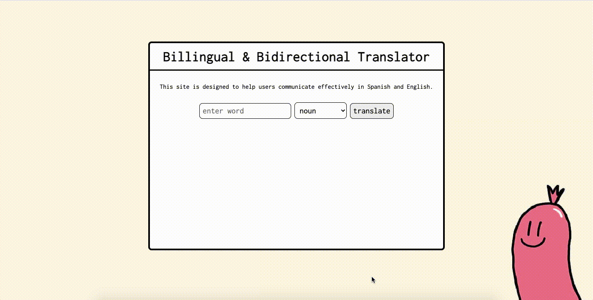

## 🚀 Goal
User can input a word in either English or Spanish and receive a translation, and a picture with an image description of the translation.

## 🚀 How it's made
Made using HTML, CSS, Javascript, API and JSON. This is also a mobile, tablet, and desktop responsive.

## 🚀 Lesson Learned
It's cool to make practical sites that users can interact with easily. It doesn't feel too complex to have APIs interact with each other. But I'm really excited to keep learning new tools for making user requests more collaborative between coders and people who create databases.
